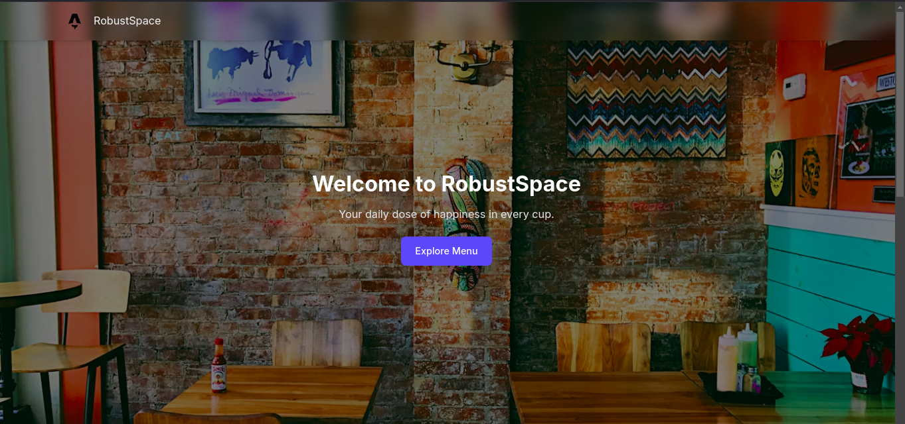

# Simple POS System

This POS application, built with Astro, is designed to facilitate seamless order operations. It includes core features such as a streamlined checkout process, product and inventory management, and transaction tracking.

## Demo

It's live on [https://pos.fairuz.my.id](https://pos.fairuz.my.id?table=01JJREA2E15B60B86W1HTPF539)

OR

(with table 10)

## Features

- Order
- Payment with [Midtrans](https://midtrans.com) (Sandbox mode)
- Authentication
- Simple Dashboard Admin

## Scenario

- Each table on place will has a QRCode for the detail.
- Every order must include the table detail.
- User will continue their order as usual.

## Endpoint

- Initial data(s) are dummy from seeding.
- Default user:  
  _Username:_ `admin`  
  _Password:_ `password`

- `/order` => Order page
- `/login` & `/register` => Authentication
- `/dashboard` => Dashboard Admin

